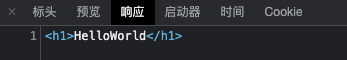
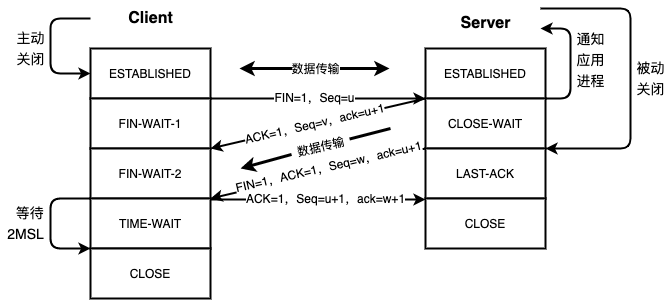

# HTTP-DEMO
## 初始化
```shell
# 初始化node环境
yarn init -y

# 安装所需依赖
yarn add typescript ts-node @types/node ts-node-dev --dev
```

在项目中新建`server.ts`

```typescript
console.log('HelloWorld');
```

执行下列代码运行项目，看看是否配置成功。

```shell
ts-node-dev server.ts
```

## 创建http-server
我们新建一个`http-server.ts`文件：
```typescript
import {createServer} from "http";

// 创建一个http server
const server = createServer((req, res) => {
    // 设置状态码
    res.statusCode = 200;
    // 设置响应头
    res.setHeader('Content-type', 'text/html');
    // 返回响应内容
    res.end('<h1>HelloWorld</h1>')
})

// 监听端口
server.listen(8080, () => {
    console.log('Server Running')
})
```
然后运行：
```shell
ts-node-dev http-server.ts
```

运行项目，然后访问`http://localhost:8080`，看是否能成功显示页面。

当我们用浏览器访问了`http://localhost:8080`，我们的`http-server`会接收到客户端的请求，然后对此做出响应。


### 响应报文

图片中`Web Server`返回的就是一段**响应报文**。

**响应报文**其实是一段文本，它的格式如下：

```
起始行（Start Line）
头信息（Headers）

主体（Entity Body）
```

因此，图片的响应报文中：
- 起始行就是`HTTP/1.1 200 OK`
- 头信息就是`Content-type:text/html   Content-length:19`
- 主体就是`<h1>HelloWorld</h1>`

起始行只有一行，它包含了最重要的响应信息：**协议版本**、**状态码**和**状态描述**。

我们代码中设置了状态码为`200`表示请求成功：`res.statusCode = 200`，常见的状态码详见[这里](https://www.runoob.com/http/http-status-codes.html) 。

头信息可以有多行，每一行都是一对键值对，比如`Content-type: text/html'，就是我们在代码中设置的`res.setHeader('Content-type', 'text/html')`。

`Content-type`表示主体所包含资源的类型，根据类型的不同，客户端可以启动不同处理程序（比如显示图像、播放声音等），下面是常见的资源：
- `text/plain`：普通文本
- `text/html`：HTML文本
- `text/jpeg`：JPEG图片
- `application/json`：JSON数据

响应的主体部分就是返回给客户端的内容，我们代码中返回了一段`html`文本，它被放在主体中：`res.end('<h1>HelloWorld</h1>')`

我们在浏览器中可以看到对应的响应报文：




## 创建tcp-server来模拟http-server
新建`tcp-server.ts`:
```typescript
// 基于TCP协议实现http服务
import {createServer} from "net";

const server = createServer(client => {
    // 可以在client实例中获取到客户端信息
    console.log('address', client.remoteAddress);
    console.log('port', client.remotePort);

    // 接收客户端数据
    client.on('data', data => {
        console.log('data', data.toString());
        // 获取并解析信息，对应返回响应报文
        client.write(`HTTP/1.1 200 OK\r
        Content-Type: text/html\r
        Content-Length: 19\r\n
        <h1>HelloWorld</h1>
`);

        // 关闭连接
        client.end();
    })
})

server.listen({
    host: '127.0.0.1',  // 监听IP
    port: '8080'        // 监听端口
},() => {
    console.log('Server Running')
})
```

运行项目：
```
ts-node-dev tcp-server.ts
```

这时候访问`http://localhost:8080`，依旧可以看到响应页面。

`net`包基于TCP协议，所以我们传入的`connectionListen`会传入一个代表客户端的`net.Socket`实例。

代码中的`client`就是这个连接的`Socker`实例，连接配对过程和断开过程就有耳熟能详的**三次握手、四次挥手**。


首先`Client`端发送连接请求报文`SYN`,`Server`端接受连接后回复确认报文`ACK`,并为这次连接分配资源。`Client`端接收到`ACK`报文后也向`Server`端发送确认连接报文`ACK`,并分配资源，这样`TCP`连接就建立了。

> **为什么是三次握手而不是两次或四次？**
> 
> 为了防止已失效的连接的请求报文突然又传到了服务端而产生错误。

建立连接之后客户端就开始传输数据，代码`client.on('data', data => { ... })`中的`data`就是请求报文，包含了客户端所有的诉求。

因此我们可以解读请求内容，并按照要求发挥响应报文：
```typescript
client.write(`HTTP/1.1 200 OK\r
    Content-Type: text/html\r
    Content-Length: 19\r\n
    <h1>HelloWorld</h1>
    `);
```

随后我们关闭了连接：`client.end()`，关闭内部过程就是**四次握手**。


