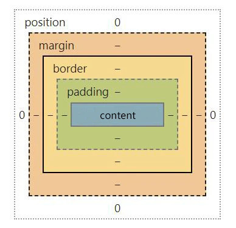
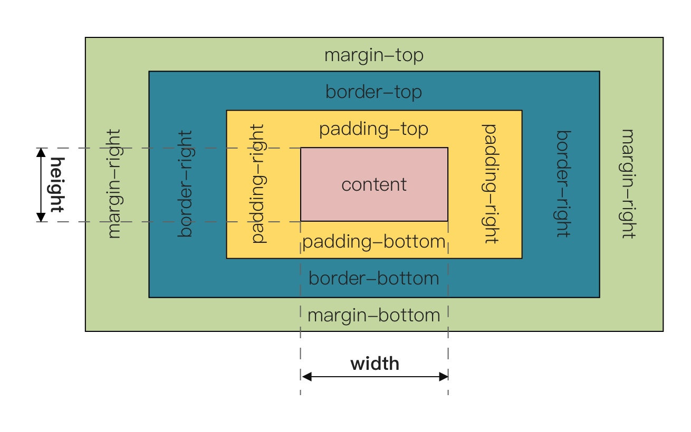
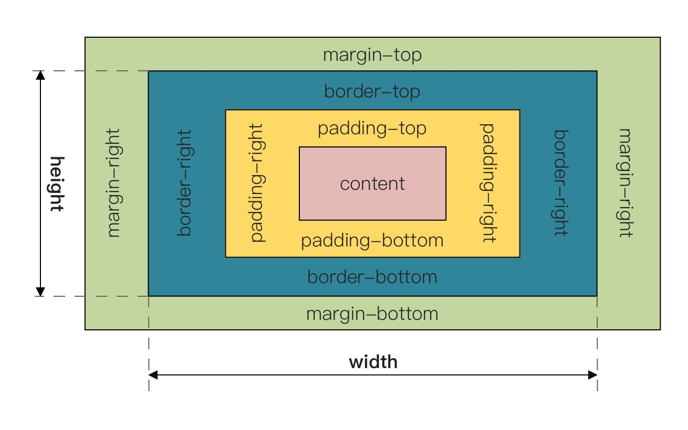

# CSS 面试题

### CSS 选择器的优先级

CSS 选择器的优先级是：**内联 > ID 选择器 > 类选择器 > 标签选择器**

到具体的计算层面，优先级是由 A、B、C、D 的值来决定：

- A 的值为 1 或 0，**存在内联样式 A 为 1，否则为 0**

- B 的值等于**ID 选择器**出现的次数

- C 的值等于**类选择器**和**属性选择器**和**伪类**出现的总次数

- D 的值等于**标签选择器**和**伪元素**出现的总次数

比较优先级的方式从 A 到 D 去比较值的大小，A、B、C、D 权重从左到右，依次减小。判断优先级的时候，从左到右，一一比较，知道
比较出最大值，即可停止。

比如下面的例子，因为第二个的 B 比第一个的 B 大，因此后面就无需比较了，第二个选择器优先级更高。（即使两个样式调换先后顺序
也是如此）

```html
<ul>
  <ol>
    <li><div class="red" id="blue">Hello World</div></li>
  </ol>
</ul>
```

```css
/* {A:0, B:0, C:1, D:3} */
ul ol li .red {
  color: red;
}

/* {A:0, B:1, C:0, D:0} */
#red {
  color: blue;
}
```

### link 和@import 的区别

- link 属于 XHTML 标签，而@import 是 CSS 提供的

- 页面被加载时，link 会同时被加载，而@import 引用的 CSS 会等到页面被加载完再加载

- @import 只在 IE5 以上才能识别，而 link 是 XHTML 标签，无兼容问题

- link 方式的样式权重高于@import 的权重

- 当使用 JavaScript 控制 DOM 去改变样式的时候，只能使用 link 标签，因为@import 不是 DOM 可以控制的

### 隐藏页面元素的方式

- `opacity: 0`

  - 本质上是将元素透明度降为 0，但是依然占据空间且可以交互

- `visibility: hidden`

  - 与上一个方法类似，占据空间，但是不可以交互

- `overflow: hidden`

  - 这个只隐藏元素溢出的部分，但是占据空间且不可交互

- `display: none`

  - 这个彻底隐藏了元素，元素从文档流中消失，即不占据空间也不交互，也不影响布局

- `z-index: -99999`

  - 原理是将层级放到底部，这样就被覆盖了，看起来隐藏了

- `transform: scale(0, 0)`

  - 平面交换，将元素缩放为 0，但是依然占据空间，但不可交互

### px\em\rem 的区别

- px：绝对单位，像素。页面按精准像素表示

- em：相对单位，基准为父节点字体的大小，如果自身定义了`font-size`则自身来计算。（浏览器默认字体为 16px）

- rem：相对单位，可以理解为 root em，相对根节点 HTML 的字体大小来计算，CSS3 新加属性，chrome、Firefox、ie9+支持

### 块级元素水平居中的方法

> 只介绍主流方式，更多居中方案
> ：[fe-study/package/css/center_in_css · GitHub](https://github.com/OUDUIDUI/fe-study/tree/master/package/css/center_in_css)

- margin 方法

```html
<style>
  .center {
    height: 200px;
    width: 200px;
    margin: 0 auto;
    border: 1px solid #222;
  }
</style>

<div class="center">HelloWorld</div>
```

- flex 布局，目前主流

```html
<style>
  .center {
    display: flex;
    justify-content: center;
  }
</style>

<div class="center">
  <div>HelloWorld</div>
</div>
```

- table 方法

```html
<style>
  .center {
    display: table;
    margin: 0 auto;
  }
</style>

<div class="center">HelloWorld</div>
```

### CSS 定位方式

- static

  - 正常文档流定位

  - 此时 top、left、right、bottom 和 z-index 属性无效，块级元素从往下纵向排布，行级元素从左向右排列

- relative

  - 相对定位

  - 此时的“相对”是相对于正常流的位置

- absolute

  - 绝对定位

  - 相对于最近的非 static 定位的祖先元素的偏移，来确定元素位置

  - 比如一个绝对定位元素它的父级别、和祖父级元素都是 relative，它会相对它的父级而产生偏移

- fixed

  - 绝对定位

  - 指定元素相对于屏幕视口（viewport）的位置来制定元素的位置，元素的位置在屏幕滚动时不会改变

  - 比如回到顶部按钮，会一直固定在视口的右下角。

- sticky

  - 粘性定位

  - 特性近似于 relative 和 fixed 的合并，当粘性定位元素在视口内时，会根据整流文档流进行定位，而当脱离视口后，会变成
    fixed 绝对定位。

  - 注意兼容性问题

### 如何理解 z-index

CSS 中的 z-index 属性控制重叠元素叠加顺序，默认元素的 z-index 为 0，我们可以修改 z-index 来控制元素的图层位置，而
且**z-index 只影响 position 值非 static 的元素**。

### 如何理解层叠上下文

> [fe-study/package/css/stacking_context](https://github.com/OUDUIDUI/fe-study/tree/master/package/css/stacking_context)

层叠上下文是 HTML 元素的三维概念，这些 HTML 元素在一条假想得相对于面向（屏幕的）视窗或者页面的用户的 z 轴上延伸，HTML 元
素依据自身属性按照优先级顺序占用层叠上下文的空间。

触发以下条件则会产生：

- HTML 的根元素`<html></html>`本身就具有层叠上下文，称为**根层叠上下文**

- 普通元素设置`position`为`absolute`（绝对定位）或 `relative`（相对定位）的时候，并设置`z-index`属性不为`auto`时，会产生
  层叠上下文

- 普通元素设置`position`为 `fixed`（固定定位）或 `sticky`（粘滞定位）的时候，会产生层叠上下文

- flex 容器的子元素，且`z-index`属性不为`auto`时，会产生层叠上下文

- grid 容器的子元素，且`z-index`属性不为`auto`时，会产生层叠上下文

- `opacity`属性值小于 1 的元素，会产生层叠上下文

- `mix-blend-mode`属性值不为`normal`的元素，会产生层叠上下文

- 以下任意属性不为`none`的元素，会产生层叠上下文：

  - `transform`
  - `filter`
  - `persective`
  - `clip-path`
  - `mask`、`mask-image`、`mask-border`

- `isolation`属性值为`isolate`的元素

- `-webkit-overflow-scrolling`属性值为`touch`的元素

- `will-change`值设定了任意属性而该属性在任何非初始值会创建层叠上下文的元素，会产生层叠上下文

- `contain`属性值为`layout`、`paint`或包含它们其中之一的合成值（比如`contain: strict`、`contain: content`）的元素

### 对 css sprites 的理解

css sprites，雪碧图。是一种 css 图像合成技术，开发人员往往将小图标合并在一起之后的图片叫雪碧图。

使用工具将多张图片打包成一张雪碧图，并为其生成合适的 css。每张图片都有响应的 css 类，该类定义
了`background-image`、`background-position`和`background-size`属性。使用图片的时候将相应的类添加到你的元素中。

- 好处

  - 减少加载多张图片的 HTTP 请求数

  - 提前加载资源

- 不足

  - css sprites 的维护成本较高，如果页面背景有少许改动，一般就要改这张合成的图片

  - 加载速度优势在 http2 开启后荡然无存，http2 多路复用，多张图片也可以重复利用一个连接通道搞定

### 对媒体查询的理解

> [深入理解 CSS Media 媒体查询 - 小火柴的蓝色理想 - 博客园](https://www.cnblogs.com/xiaohuochai/p/5848612.html)

媒体查询有一个可选的媒体类型和零个或多个使用媒体功能的限制样式表范围的表达式组成，比如宽度、高度或颜色。

媒体查询添加至 CSS3，允许内容的呈现针对一个特定范围的输出设备而进行裁剪，而不必改变内容本身，非常适合 Web 网页应对不同型
号的设备而做出对应的响应适配。

每条媒体查询语句都由一个可选的**媒体类型**和任意数量的**媒体特性**表达式构成。可以使用多种**逻辑操作**符合并多条媒体查询
语句。媒体查询语句不区分大小写。

当媒体类型（如果指定）与在其上显示文档的设备匹配并且所有媒体功能表达式都计算为 true 时，媒体查询将计算为 true。 涉及未知
媒体类型的查询始终为 false。

```html
<!-- link元素中的css媒体查询 -->
<link rel="stylesheet" media="(max-width: 800px)" href="example.css" />
```

```css
/* 样式表中的css媒体查询 */
@media (max-width: 600px) {
    .page {
    display: none;
    }
}
```

### 对盒模型的理解

> [深入理解盒模型 - 小火柴的蓝色理想 - 博客园](https://www.cnblogs.com/xiaohuochai/p/5202597.html)

当对一个文档进行布局的时候，浏览器的渲染引擎会根据标准之一的 css 基础框盒模型（CSS basic box model），将所有元素表示为一
个个矩形的盒子。css 决定这些盒子的大小、位置以及属性（颜色、背景、边框等等）。

盒模型有 content（内容）、padding（内边距）、border（边框）、margin（外边距）组成的。



#### 标准盒模型和怪异盒模型

在 W3C 标准下，我们定义元素的`width`的值为盒模型的 content 的宽度，`height`值为 content 的高度值。

因此，标准盒模型下的宽度等于
：`margin-left`+`border-left`+`padding-left`+`width`+`padding-right`+`border-right`+`margint-right`。



而怪异盒模型的`width`并不是 content 的宽度，而是`border-left`+`padding-left`+`content`+`padding-right`+`border-right`。



虽然现在浏览器默认使用 W3C 的标准盒模型，但是在不少情况下怪异盒模型更好用，于是 W3C 在 CSS3 加入了`box-sizing`。

```css
box-sizing: content-box; /* 标准盒模型 */
box-sizing: border-box; /* 怪异盒模型 */
box-sizing: padding-box; /* 火狐私有的模型，很少人用 */
```

### 对 BFC 的理解

> [深入理解 BFC - 小火柴的蓝色理想 - 博客园](https://www.cnblogs.com/xiaohuochai/p/5248536.html)

BFC（Block Formatting Context）

- Box：CSS 布局的对象和基本单位，直观点来说，一个页面是由多个 Box 组成的，也就是一个个盒模型

- Formatting Context：块级上下文格式化，它是页面中的一块渲染区域，并且有一套渲染规则，它决定了其子元素将如何定位，以及和
  其他元素的关系和相互作用

简而言之，它是一块独立的区域，让处于 BFC 内部的元素和外面的元素相互隔离。

BFC 触发条件：

- 根元素，即 HTML 元素

- position 为 fixed、absolute、sticky

- float 不为 none

- overflow 不为 visible

- display 的值为 inline-block、table-cell、table-caption

作用：防止 margin 发生重叠、两栏布局时防止文字环绕、防止元素塌陷。

### 为什么改变位置常用 translate 而不是定位

`translate()`是 transform 的一个属性。

- 改变 transform 或 opacity 不会触发浏览器重新布局（reflow）或重绘（repaint），只会触发复合（compositions），而改变绝对
  定位会触发重新布局，进而触发重绘和复合。

- transform 使浏览器为元素创建一个 GPU 图层，但改变绝对定位会使用到 CPU，因此 transform 会更高效，可以缩短平滑动画的绘制
  时间

- translate 改变位置时，元素依然会占据其原始空间，而决定定位不会发生这种情况

### 伪类和伪元素的区别

> [总结伪类与伪元素 | AlloyTeam](http://www.alloyteam.com/2016/05/summary-of-pseudo-classes-and-pseudo-elements/)

伪类（pseudo-class）：是一个以冒号`:`作为前缀，被添加到一个选择器末尾的关键字，当你希望样式在特定状态下才被呈现指定元素
时，你可以往元素的选择器后面加上对应的伪类。

伪元素用于创建一些不再文档树中的元素，并为其增加样式。比如我们可以通过`::before`来在一个元素前增加一些文本，并为这些文本
增加样式。虽然用户可以看到这些文本，但是这些文本实际上不在文档树中。

区别：伪类是通过元素选择器上加入伪类改变元素状态，而伪元素通过对元素的操作进行对元素的改变。

### flex 的理解

> [Flex 布局教程：语法篇 - 阮一峰的网络日志](http://www.ruanyifeng.com/blog/2015/07/flex-grammar.html)
>
> [Flex 布局教程：实例篇 - 阮一峰的网络日志](http://www.ruanyifeng.com/blog/2015/07/flex-examples.html)

Web 应用有不同设备尺寸和分辨率，这是需要响应式布局界面设计来满足复杂的布局需求，Flex 弹性盒模型的优势在于开发人员只是声
明应该具有的行为，而不需要给出具体的实现方式，浏览器就会负责完成实际布局。

当布局设计到不定宽度，分布对齐的场景时，就要优先考虑弹性布局。

### 关于 CSS 的动画和过渡问题

> [深入理解 CSS 动画 animation - 小火柴的蓝色理想 - 博客园](https://www.cnblogs.com/xiaohuochai/p/5391663.html)
>
> [深入理解 CSS 过渡 transition - 小火柴的蓝色理想 - 博客园](https://www.cnblogs.com/xiaohuochai/p/5347930.html)
