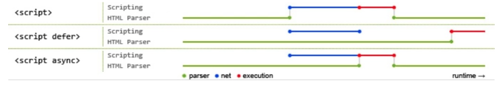

# HTML 面试题

### DOCTYPE 的作用是什么？

> 参考链接
> ：[怪异模式和标准模式 - HTML（超文本标记语言） | MDN](https://developer.mozilla.org/zh-CN/docs/Web/HTML/Quirks_Mode_and_Standards_Mode)

DOCTYPE 是 HTML 的标准网页声明，且必须声明在 HTML 文档的第一行，来告知浏览器的解析器用什么文档标准来解析这个文档，不同的
渲染模式会影响到浏览器对 CSS 代码甚至 JavaScript 脚本的解析。

文档解析模式有：

- **怪异模式（quirks mode）**：该模式会支持一些非标准的特性来解析渲染页面。（如果没有声明 DOCTYPE，默认会该模式）

- **标准模式（standards mode）**：浏览器会是使用 W3C 的标准解析渲染页面。（通常都是使用该模式：`<!DOCTYPE html>`）

- **准标准模式（almost standards mode）**：该模式下浏览器支持很多标准的特性，但没有标准规定那么严格。（该模式与标准模式
  非常接近，很少需要区分）

三种模式的区别：

- 怪异模式：页面按照 HTML 与 CSS 的定义渲染；

- 标准模式：会模拟更旧的浏览器的行为

- 准标准模式：会实施一种表单元格尺寸的怪异行为（与 IE7 之前的单元格布局方式一致），除此之外符合标准模式

### HTML、XHTML、XML 有什么区别

> 参考链接
> ：[HTML - 术语表 | MDN](https://developer.mozilla.org/zh-CN/docs/Glossary/HTML)、[XML - 术语表 | MDN](https://developer.mozilla.org/zh-CN/docs/Glossary/XML)、[XHTML - 术语表 | MDN](https://developer.mozilla.org/zh-CN/docs/Glossary/XHTML)

- **HTML（超文本标记语言）**：用来描述和定义网页内容的标记语言。在 HTML4.0 之前 HTML 先有实现再有标准，导致 HTML 非常混
  乱和松散

- **XML（可扩展标记语言）**：主要用于存储数据和结构，跟 JSON 也是相似的作用，但是更加轻量高效

- **XHTML（可扩展超文本标记语言）**：W3C 为了解决 HTML 的混乱问题，因此将 HTML 和 XML 进行结合，从而形成一种 HTML 的严格
  语法形式

### 对 HTML 语义化的理解

语义化是指使用恰当的语义 HTML 标签，让页面具有良好的结构与含义。比如`<p>`代表段落、`<article>`代表正文等等。

语义化的好处主要有两点：

- 开发者友好：适用语义类标签增强了可读性，开发者也能够清晰地看出网页的结构，也更便于团队的开发和维护；

- 机器友好：带有语义的文字表现力丰富，更适合搜索引擎的爬虫爬取有效信息，增强页面 SEO。

### HTML5 和 HTML4 的不同之处

- 文件类型生命仅有一种：`<!DOCTYPE HTML>`

- 新的解析顺序，不再基于[SGML](https://developer.mozilla.org/zh-TW/docs/Glossary/SGML)

- 新的元素
  ：`section`、`video`、`progress`、`nav`、`meter`、`time`、`aside`、`canvas`、`command`、`datalist`、`details`、`embed`、`figcaption`、`figure`、`fotter`、`header`、`hgroup`、` keygen、``mark `、`output`、`rp`、`rt`、`ruby`、`source`、`summary`、`wbr`

- `input`元素新的类型：date、email、url 等

- 新的属性：`ping`（用于`<a>`与`area`），`charset`（用于`<meta>`），`async`（用于`<script>`）

- 全域属性：`id`、`tabindex`、`repeat`

- 新的全域属性：`contentedittable`、`contextmenu`、`draggable`、`dropzone`、`hidden`、`spellcheck`

- 移除元素
  ：`acronym`、`applet`、`basefont`、`big`、`center`、`dir`、`font`、`frame`、`frameset`、`isindex`、`noframes`、`strike`、`tt`

### 有哪些常用的`meta`标签

`meta`标签有 name 和 content 两个属性来定义，来描述一个 HTML 网页文档的属性，例如作者、日期和时间、网页藐视、关键词、页
面刷新等。

- charset：用于描述 HTML 文档的编码格式

  ```html
  <meta chartset="UTF-8" />
  ```

- http-equiv：相当于 http 的文件头作用，比如下面的代码可以设置 http 的缓存过期时间

  ```html
  <meta http-equiv="expires" content="Sun Jan 09 2022 15:26:11 GMT+0800" />
  ```

- viewport：控制视口的大小和比例

  ```html
  <meta name="viewport" content="width=device-width initial-scale=1 maximun-scale=1" />
  ```

- apple-mobile-web-app-status-bar-style：设置苹果手机状态栏背景颜色

  ```html
  <meta name="apple-mobile-web-app-status-bar-style" content="black-translucent" />
  ```

### src 和 href 的区别

- **src 是指向外部资源的位置**，指向的内容会嵌入到文档中当前标签所在的位置，在请求 src 资源时会将其指向的资源下载并应用
  到文档内，如 js 脚本、img 图片和 frame 等元素。当浏览器解析到该元素时，会暂停其他资源的下载和处理，直到将该资源加载、
  编译、执行完毕，所以一般 js 脚本会放在底部而不是头部。

- **href 是指向网络资源的所在位置（超链接）**，用来建立和当前元素或文档之间的连接，当浏览器识别到它指向的文件时，就会并
  行下载资源，不会停止对当前文档的处理。

### `img`的 srcset 的作用

可以设计响应式图片，我们可以使用两个新的属性 srcset 和 sizes 来提供更多额外的资源图片和提示，帮助浏览器选择正确的一个资
源。

- srcset 定义了我吗运行浏览器选择的图像集，以及每个图像的大小

- sizes 定义了一组媒体条件（例如屏幕宽度）并且指明当某些媒体条件为真时，什么样的图片尺寸是最佳选择

所以有了这些属性，浏览器可以：

- 查看设备的宽度

- 检查 sizes 列表中哪个媒体条件是第一个为真

- 查看给予该媒体查询的槽大小

- 加载 srcset 列表中引用最接近所选的槽大小的图像

```html
<!-- srcset提供根据屏幕条件选取图片的能力 -->

```

同时，`<picture>`元素通过包含零或多个`<source>`和一个``元素来为不同的显示/设备场景提供图像版本。浏览器会选择最匹配
的子`<source>`元素，如果没有匹配的``元素的 src 属性中的 URL，然后，所选图像呈现在``元素占据的空间。

```html
<picture>
  <source srcset="demo-200.png" media="(min-width: 800px)" />
  
</picture>
```

### script 标签中的 defer 和 async 的区别

- defer：浏览器指示脚本在文档被解析后执行，script 被异步执行加载后并不会立刻执行，而是等到文档全部被解析后执行

- async：同样是异步加载脚本，区别是脚本加载完毕后立即执行，这导致 async 属性下的脚本是乱序的，对于 script 有前后依赖关系
  的情况下并不适用。

> 蓝色线代表网络读取，红色线代表执行时间，这两个都是针对脚本的；绿色线代表 html 解析



### 前端存储方式

- cookie

  - 在 HTML5 标准前本地存储的主要方式

  - 优点是兼容性好，请求头自带 cookies

  - 缺点是大小只有 4k，自动请求头加入 cookie 浪费流量，每个 domain 限制 20 个 cookie，使用起来麻烦，需要自行封装

- localStorage

  - HTML5 加入的以键值对为标准的方式

  - 优点是操作方便，永久性存储（触发手动删除），大小为 5M，兼容 IE8+

- sessionStorage

  - 与 localStorage 基本类似，区别是 sessionStorage 当前页面关闭后会被清理，而且与 cookie、localStorage 不同的是，它不能
    在所有同源窗口中共享，是会话级别的存储方式

- Web SQL

  - 2010 年被 W3C 废弃的本地数据库存储方案，但是主流浏览器（火狐除外）都已经有了相关实现

  - Web SQL 类似 SQLite，是真正意义上的关系型数据库，用 SQL 进行操作，当我们用 JavaScript 时要进行转换，较为繁琐

- IndexedDB

  - 是被正式纳入 HTML5 标准的数据库存储方案，它是 NoSQL 数据库，用键值对进行存储，可以进行快速读取操作，非常适合 Web 场
    景，同时用 JavaScript 进行操作会非常方便
