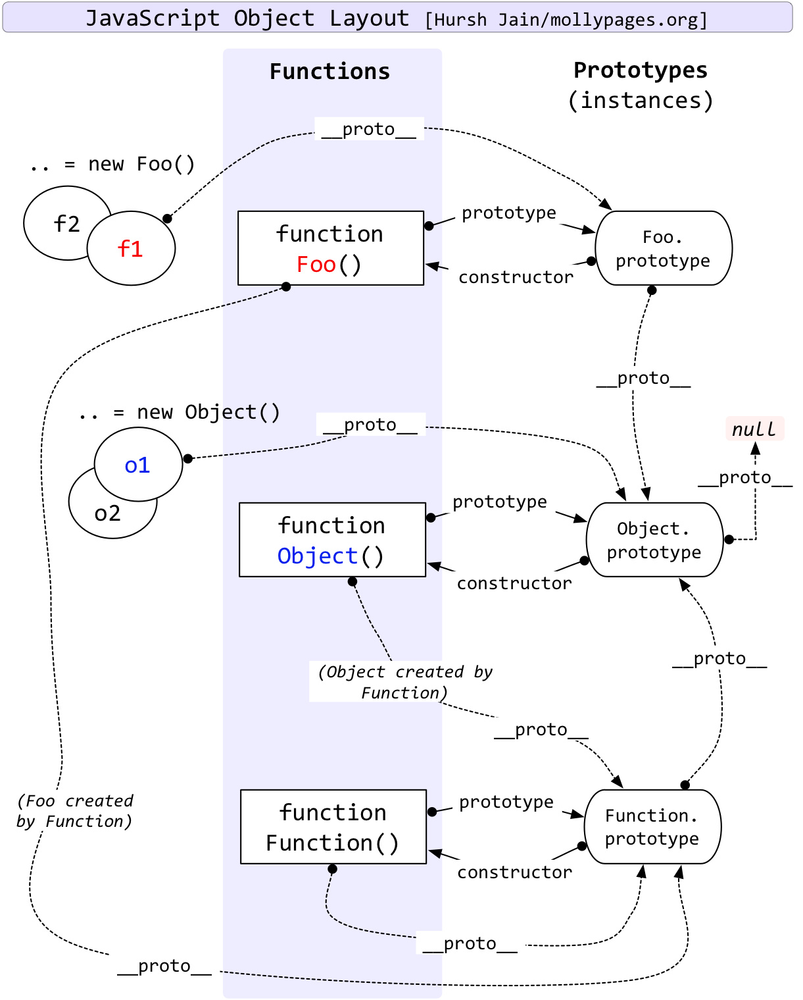

# JavaScript 面试题

### 解释一下变量提升

JavaScript 引擎的工作方式是先解析代码，获取所有被声明的变量，然后再一行行地运行。这造成的结果就是所有的变量的声明语句，
都会被提升到代码的头部，这就叫做变量提升（hoisting）。

```javascript
console.log(a); // undefined

var a = 1;

function b() {
  console.log(a);
}

b(); // 1
```

上面的代码实际执行顺序是这样的：

第一步，JS 引擎将`var a = 1`拆解为`var a = undefined`和`a=1`，并将`var a = undefined`放到了最顶部，`a=1`保留原位。

这样一来代码就是这样：

```javascript
var a = undefined; // 变量声明被提升上来

console.log(a); // undefined

a = 1; // 赋值操作保留原位

function b() {
  console.log(a);
}

b(); // 1
```

第二步就是执行，因此 JS 引擎逐行从上到下执行，也就是造成了当前的结果，这就是变量提升。

### 理解闭包

#### 什么是闭包

闭包是函数和声明该函数的词法环境的组合。简单来说就是闭包 = 「函数」+ 「函数体内可访问的变量总和」。

举个简单的例子：

```javascript
(function () {
  var a = 1;
  function add() {
    var b = 2;
    var sum = b + a;
    console.log(sum); // 3
  }

  add();
})();
```

`add`函数本身，以及其内部可访问的变量，即`a`，这两个组合在一起就被成为闭包，仅此而已。

#### 闭包的作用

闭包最大的作用就是隐藏变量，闭包的一大特性就是**内部函数总是可以访问其所在的外部函数中声明的参数和变量，即使在其外部被返
回（周期结束）了之后**。

基于此特性，JavaScript 可以实现私有变量、特权变量、存储变量等。

我们就以私有变量为例。

```javascript
function Person() {
  var name = 'OUDUIDUI';
  this.getName = function () {
    return name;
  };
  this.setName = function (value) {
    name = value;
  };
}

const person = new Person();

console.log(person.getName()); // OUDUIDUI
person.setName('OU');
console.log(person.getName()); // OU
console.log(name); // name is not defined
```

函数体内的`name`变量只有`getName`和`setName`能有访问，外部无法访问，相对于将其私有化。

### 理解 JavaScript 的作用域链

JavaScript 属于静态作用域，即声明的作用域是根据程序正文在编译时就确定的，有时也称为词法作用域。

其本质是 JavaScript 在执行过程中会创造可执行上下文，可执行上下文中的词法环境中含有外部词法环境的引用，我们可以通过这个引
用获取外部词法环境的变量、声明等，这些引用串联起来一致指向全局的词法环境，因此形成了作用域链。

### ES6 模块与 CommonJS 模块的区别

- 区别：
  
  - commonJS 是对模块的浅拷贝，ES6 Module 是对模块的引用，即 ES6 Module 只存只读，不能改变其值，具体点就是指针指向不能变
    ，类似 const

- 共同点：
  
  - CommonJS 和 ES6 Module 都可以对引入的对象进行赋值，即对对象内部属性的值进行改变

### JavaScript 有哪些类型

JavaScript 的类型分为两大类，即原始类型和复杂（引用）类型。

- 原始类型
  
  - boolean、string、number、undefined、null、symbol

- 复杂类型
  
  - Object

> 还有一个没有正式发布但即将加入标准的原始类型 BigInt。
> 
> JavaScript 中的 Number.MAX_SAFE_INTEGER 表示最大安全数字，为 900719925470991，即在这个数范围内不会出现精度丢失（小数除
> 外）。但是一旦超过这个范围，JavaScript 就会出现计算不准确的问题，这在大数计算的时候不得不依靠一些第三方库进行解决，因
> 此官方提出了 BigInt 来解决这个问题

#### null 和 undefined 的区别

null 表示为空，代表此处不应该有值的存在，一个对象可以为 null，代表是个空对象，而 null 本身也是个对象。

undefined 表示不存在，JavaScript 是一门动态类型语言，成员除了表示存在的空值外，还有可能根本不存在，因为存不存在只有在运
行时才会知道，这就是 undefined 的意义所在。

### 为什么 0.1 + 0.2 不等于 0.3

```shell
> 0.1 + 0.2
0.30000000000000004
```

JavaScript 的 Number 类型遵循的是 IEEE 754 标准，使用的是 64 位固定长度来表示。

IEEE 754 浮点数有三个域组成，分别为 sign bit（符号位）、exponent bias（指数偏移值）、fraction（分数值）。64 位中，sign
bit 占 1 位，exponent bias 占了 11 位，fraction 占 52 位。

通过公式表示浮点数的值：`value = sign x exponent x fraction`

当一个数为正数的时候，sign bit 为 0，当为负数的时候，sign bit 为 1。

以`0.1`转换为 IEEE 754 标准表示为例来解释一下 exponent bias 和 fraction。转换主要历经 3 个过程：

- 将`0.1`转换为二进制

- 将转换后的二进制通过科学计数法表示

- 将通过科学计数法表示的二进制转换为 IEEE 754 标准来表示

首先将`0.1`转换成二进制。小数部分转成二进制，只需将其小数部分乘以 2，然后取整数部分的结果，然后再用计算后的小数部分重复
计算，直至小数部分为 0。

因此`0.1`转换为二进制的过程如下：

| 小数  | x2  | 整数部分 |
| --- | --- | ---- |
| 0.1 | 0.2 | 0    |
| 0.2 | 0.4 | 0    |
| 0.4 | 0.8 | 0    |
| 0.8 | 1.6 | 1    |
| 0.6 | 1.2 | 1    |
| 0.2 | 0.4 | 0    |
| 0.4 | 0.8 | 0    |
| 0.8 | 1.6 | 1    |
| 0.6 | 1.2 | 1    |
| ... | ... | ...  |

得到`0.1`的二进制表示为 0.0001100110011... （无限循环 0011）

紧接着将其二进制转成科学计数法，则为`1.10011001...(无限循环1001) e-4`

最后将其转化成 IEEE 754 标准表示。

exponent bias（指数偏移值）等于**双精度浮点数固定偏移值**（2^10 -1 = 1023）加上指数实际值的 11 位二进制表示。（exponent
bias 占了 11 位，所以只能够 11 位二进制）

因此`0.1`的 exponent bias 等于`1024 + (-4) = 1019`，然后转成 11 位二进制为`011 1111 1011`。

fraction 就是科学计数法后的小数部分，而因为 fraction 占 52 位，所以只能抽取前 52 位小数。

而这里有小细节，52 位小数部分最后四位刚好是`1001`，而第 53 位是`1`，这时候会采取四舍五入，进一位，因此 52 位小数部分最后
四位就变成了`1010`，而这恰恰就是 0.1 + 0.2 不等于 0.3 的原因。额

因此`0.1`转成 IEEE 754 最后的结果为：

```
0 01111111011 1001100110011001100110011001100110011001100110011010
```

但此时将这个 IEEE 754 标准的数值转成十进制，可以发现值已经变成了`0.100000000000000005551115123126`，而不是`0.1`了。

### 类型转换的原理

**类型转换**指的是将一种类型转换成另一种类型，例如：

```javascript
const b = 2;
const a = String(b);
console.log(typeof a); // string
```

**类型转换**分为显式和隐式，但是不管哪一种，都会遵循一定的原理。由于 JavaScript 是一门动态类型的语言，可以随时赋予任意值
，但是各种运算符或条件判断中是需要特定类型的，因此 JavaScript 引擎会在运算时为变量设定类型。

虽然这看起来很美好，JavaScript 引擎帮我们搞定了类型的问题，但是引擎毕竟不是 ASI（超级人工智能），它的很多动作会跟我们的
预期相去甚远，我们可以从一道面试题看起：

```javascript
console.log({} + []); // 0
```

JavaScript 类型转换可以从**原始类型**转为**引用类型**，同样可以将**引用类型**转成**原始类型**，而转为原始类型的抽象操作
为`toPrimitive`，而后续更加细分的操作为`toNumber`、`toString`、`toBoolean`。

为了更深入的探究 JavaScript 引擎是如何处理代码中的类型转换问题，就需要看 ECMA-262 详细的规范，从而探究其内部原理，我们从
这段原理示意代码开始：

```javascript
// ECMA-262, section 9.1, page 30. Use null/undefined for no hint,
// (1) for number hint, and (2) for string hint.
function ToPrimitive(x, hint) {
  // Fast case check.
  if (IS_STRING(x)) return x;
  // Normal behavior.
  if (!IS_SPEC_OBJECT(x)) return x;
  if (IS_SYMBOL_WRAPPER(x)) throw MakeTypeError(kSymbolToPrimitive);
  if (hint == NO_HINT) hint = (IS_DATE(x)) ? STRING_HINT : NUMBER_HINT;
  return (hint == NUMBER_HINT) ? DefaultNumber(x) : DefaultString(x);
}

// ECMA-262, section 8.6.2.6, page 28.
function DefaultNumber(x) {
  if (!IS_SYMBOL_WRAPPER(x)) {
    var valueOf = x.valueOf;
    if (IS_SPEC_FUNCTION(valueOf)) {
      var v = %_CallFunction(x, valueOf);
      if (IsPrimitive(v)) return v; }
    var toString = x.toString;
    if (IS_SPEC_FUNCTION(toString)) {
      var s = %_CallFunction(x, toString);
      if (IsPrimitive(s)) return s; }
  }
  throw MakeTypeError(kCannotConvertToPrimitive);
}

// ECMA-262, section 8.6.2.6, page 28.
function DefaultString(x) {
  if (!IS_SYMBOL_WRAPPER(x)) {
    var toString = x.toString;
    if (IS_SPEC_FUNCTION(toString)) {
      var s = %_CallFunction(x, toString);
      if (IsPrimitive(s)) return s; }
    var valueOf = x.valueOf;
    if (IS_SPEC_FUNCTION(valueOf)) {
      var v = %_CallFunction(x, valueOf);
      if (IsPrimitive(v)) return v; }
  }
  throw MakeTypeError(kCannotConvertToPrimitive);
}
```

上面的代码逻辑是这样的：

- 如果变量是字符串，直接返回

- 如果`!IS_SPEC_OBJECT(x)`，直接返回

- 如果`IS_SYMBOL_WRAPPER(x)`，则抛出错误

- 否则会根据传入的`hint`来调用`DefaultNumber`和`DefaultString`，比如如果是`Date`对象，会调用会`DefaultString`
  
  - `DefaultNumber`：首先`x.valueOf`，如果为`primitive`，则返回`valueOf`后的值，否则继续调用`x.toString`，如果
    为`primitive`，则返回`toString`后的值，否则抛出异常
  
  - `DefaultString`和`DefaultNumber`正好相反，先调用`toString`，如果不是`primitive`再调用`valueOf`

那讲完实现原理，这个`toPrimitive`有什么用呢？实际上很多操作会调用`toPrimitive`，比如加运算、相等操作或比较操作等。在执行
加运算操作时就会将左右的操作数转换为`primitive`，然后再进行相加。

下面来个实例：`({}) + 1`会输出什么？（将`{}` 放在括号里是为了让内核将其认为一个代码块）

加操作只会左右两边同时为 string 或 number 时才会执行对应的`%_StringAdd`或`%_NumberAdd`，而上面的例子会经过以下步骤：

- `{}`和`1`首先会同时调用`toPrimitive`函数

- 而`{}`会走到`DefaultNumber`，首先调用`valueOf`，返回`{}`对象，不是 primitive 类型，则继续调用`toString`，返
  回`[object object]`字符串

- 因此最后`({})+1`转换成了`'[object object]' + 1`，最后输出为字符串`'[object object]1'`

如果是`[]+1`的话，则最后结果为字符串`'1'`，因为`[]`执行`toPrimitive`的结果是空字符串。

### 对原型链的理解

绝大部分的函数（少数内建函数除外）都有一个`prototype`属性，这个属性是原型对象用来创建新对象实例的，而所有被创建的对象都
会共享原型对象，因此这些对象都可以访问原型对象的属性。

例如`hasOwnProperty()`方法就存在于 Object 原型对象中，它便可以被任何对象当做自己的方法使用。

```javascript
const person = {
  name: 'OUDUIDUI',
  age: 29
};
console.log(person.hasOwnProperty('name')); // true
console.log(person.hasOwnProperty('hasOwnProperty')); // false
console.log(person.prototype.hasOwnProperty('hasOwnProperty')); // true
```

由上面的代码可知，`hasOwnProperty`并不存在于`person`对象中，但是`person`依然可以拥有此方法。而`person`对象找到`Object`对
象中的`hasOwnProperty`方法靠的就是原型链。

每个对象都有`__proto__`属性，此属性指向该独享的构造函数的原型。

对象可以通过`__proto__`与上游的构造函数的原型对象连接起来，而上游的原型对象也有一个`__proto__`，这样也就形成了原型链。


